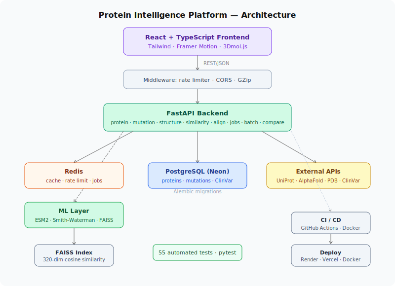

# Protein Intelligence Platform

**Live Demo:** [protein-intelligence-tau.vercel.app](https://protein-intelligence-tau.vercel.app) &nbsp;·&nbsp; **API Docs:** [protein-intelligence-otcg.onrender.com/docs](https://protein-intelligence-otcg.onrender.com/docs)


---

**Features:**
✓ Protein search (UniProt REST API)
✓ Mutation analysis + ClinVar clinical annotations
✓ AlphaFold 3D structure visualization (3Dmol.js, pLDDT coloring)
✓ ESM2 protein language model embeddings (facebook/esm2_t6_8M_UR50D)
✓ FAISS cosine similarity search across 100+ indexed proteins
✓ Smith-Waterman local sequence alignment (implemented from scratch, BLOSUM62)
✓ Protein comparison page (sequence identity + ESM2 similarity + domain diff)
✓ Batch CSV mutation processing (up to 50 rows)
✓ PDF report download (ReportLab)
✓ Sliding window rate limiter (Redis + Lua script, atomic)

**Stats:**
9 API endpoints · 5 database tables · 55 automated tests · Redis caching · Docker deployment · ESM2 embeddings · FAISS similarity search · Alembic migrations

**Tech Stack:**
FastAPI · React · TypeScript · PostgreSQL · Redis · Docker · FAISS · ESM2 · Smith-Waterman · ReportLab · Alembic · GitHub Actions

---

## Screenshots

> Add screenshots here after deployment. See [docs/screenshots/README.md](docs/screenshots/README.md) for filenames.

---

## Architecture



---

## Quick Start

```bash
git clone https://github.com/Auntara12/protein-intelligence
cd protein-intelligence

# Full stack with Docker (recommended)
docker compose up --build

# API docs:  http://localhost:8000/docs
# Frontend:  http://localhost:3000
```

**Local development without Docker:**
```bash
# Backend
cd backend && python -m venv venv && source venv/bin/activate
pip install -r requirements.txt
cp .env.example .env        # edit DATABASE_URL and REDIS_URL
uvicorn app.main:app --reload

# Frontend
cd frontend && npm install && npm run dev
```

**Run tests:**
```bash
make test-unit    # 55 unit tests, no DB required, runs in ~0.2s
make test         # full suite including integration tests
make test-cov     # with coverage HTML report
```

---

## API Reference

| Method | Endpoint | Description |
|---|---|---|
| GET | `/api/v1/protein/{gene}` | UniProt metadata, sequence, domains, disease annotations |
| GET | `/api/v1/mutation/{gene}/{mutation}` | Biochemical property changes + domain context + ClinVar |
| GET | `/api/v1/structure/{gene}` | AlphaFold/PDB structure + 3Dmol.js viewer config |
| GET | `/api/v1/similar/{gene}` | ESM2 + FAISS cosine similarity search |
| GET | `/api/v1/align/{gene1}/{gene2}` | Smith-Waterman local alignment, BLOSUM62, affine gap penalties |
| GET | `/api/v1/compare/{gene1}/{gene2}` | Side-by-side comparison: alignment + ESM2 similarity + domain diff |
| POST | `/api/v1/batch-analyze` | CSV bulk mutation analysis (max 50 rows) |
| GET | `/api/v1/report/{gene}/pdf` | Download PDF research report |
| POST | `/api/v1/embed/{gene}` | Submit background ESM2 embedding job (non-blocking) |
| GET | `/api/v1/embed/status/{job_id}` | Poll embedding job completion |
| GET | `/api/v1/health` | System health: DB · Redis · FAISS index status |

**Test your deployment:**
```bash
curl https://protein-intelligence-otcg.onrender.com/api/v1/health
curl https://protein-intelligence-otcg.onrender.com/api/v1/protein/TP53
curl https://protein-intelligence-otcg.onrender.com/api/v1/mutation/TP53/R175H
curl https://protein-intelligence-otcg.onrender.com/api/v1/compare/TP53/TP63
```

---

## ML Pipeline

**ESM2 embeddings:** `facebook/esm2_t6_8M_UR50D` (8M parameters) generates 320-dimensional mean-pooled sequence representations. Inference runs in a background job so the API stays non-blocking. Vectors are L2-normalized before indexing — inner product search equals cosine similarity.

**FAISS index:** `IndexFlatIP` with L2-normalized vectors. O(1) insert, O(n) exhaustive search. Persisted to disk across container restarts. Metadata in a JSON sidecar; raw vectors as `.npy` files.

**Smith-Waterman alignment:** Implemented from scratch using dynamic programming with affine gap penalties (open: −11, extend: −1) and the full BLOSUM62 substitution matrix (400 entries, verified symmetric). O(mn) time and space. CPU-bound work dispatched via `asyncio.to_thread` to keep the API non-blocking. Complements ESM2 similarity: high alignment score + low embedding similarity indicates functional divergence despite sequence conservation.

---

## Database Schema

| Table | Key columns |
|---|---|
| `proteins` | gene_name (unique index), uniprot_id, sequence, domains (JSON), disease_annotations (JSON), search_count |
| `mutations` | gene_name, mutation_str, charge_change, polarity_change, domain, predicted_effect, is_known_pathogenic |
| `structures` | gene_name, alphafold_pdb_url, pdb_id, confidence_score (pLDDT), resolution_angstrom, method |
| `embeddings` | gene_name, model_name, embedding_dim, faiss_index_id, sequence_length |
| `clinvar` | gene_name, mutation_str, clinical_significance, disease_name, variant_id, review_status |

Migrations managed by **Alembic** — run automatically on startup, or manually: `make migrate`.

---

## Rate Limiting

Sliding window algorithm using Redis sorted sets with an atomic Lua script. Prevents burst attacks at window boundaries unlike fixed-window counters. Returns standard `X-RateLimit-Limit/Remaining/Reset` headers. Degrades gracefully to no-limit if Redis is unavailable.

Default: 100 requests / 60 seconds per IP. Configured via `RATE_LIMIT_REQUESTS` and `RATE_LIMIT_WINDOW` environment variables.

---

## Deployment

See [DEPLOYMENT.md](DEPLOYMENT.md) for the complete step-by-step guide.

**Short version:**
- Database: [Neon](https://neon.tech) (free, persistent, serverless PostgreSQL)
- Backend: [Render](https://render.com) (free web service + Redis)
- Frontend: [Vercel](https://vercel.com) (free, auto-deploys on push)

Key environment variables:

| Variable | Where | Notes |
|---|---|---|
| `DATABASE_URL` | Render | From Neon. Auto-converts `postgresql://` → `postgresql+asyncpg://` |
| `REDIS_URL` | Render | Internal Redis URL from Render |
| `ALLOWED_ORIGINS` | Render | Comma-separated. Include your Vercel URL. |
| `VITE_API_URL` | Vercel | Your Render backend URL |

---

## Tech Stack

| Layer | Technologies |
|---|---|
| Backend | Python 3.11, FastAPI, SQLAlchemy (async), Alembic, Pydantic v2 |
| ML | PyTorch, HuggingFace ESM2, FAISS, NumPy, Biopython, ReportLab |
| Frontend | React 18, TypeScript, Tailwind CSS, Framer Motion, React Query, 3Dmol.js |
| Data stores | PostgreSQL 16 (Neon), Redis 7, asyncpg, aiosqlite |
| External APIs | UniProt REST, AlphaFold DB, RCSB PDB, NCBI ClinVar |
| DevOps | Docker, Docker Compose, GitHub Actions, Render, Vercel |
| Testing | pytest, pytest-asyncio, httpx, respx — 55 tests |

---

## References

- [AlphaFold Protein Structure Database](https://alphafold.ebi.ac.uk/) (Jumper et al., 2021)
- [ESM-2: Language models of protein sequences](https://www.science.org/doi/10.1126/science.ade2574) (Lin et al., 2022)
- [Smith-Waterman local alignment](https://doi.org/10.1016/0022-2836(81)90087-5) (Smith & Waterman, 1981)
- [BLOSUM62 substitution matrix](https://www.ncbi.nlm.nih.gov/pmc/articles/PMC50585/) (Henikoff & Henikoff, 1992)
- [UniProt Knowledgebase](https://www.uniprot.org/) (UniProt Consortium)

---

*Built by Auntara Nandi*
